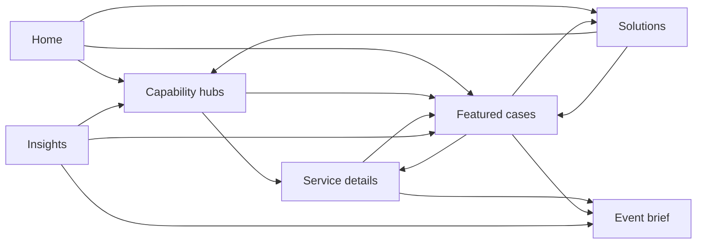

# Recommended information architecture

## Architecture principles

- Organize around how brand/agency buyers evaluate a partner: capabilities, use cases, proof, process and contact.
- Keep format-level pages only where there is differentiated demand and evidence.
- Use one route record to bind Turkish and English alternates; never infer translation by string replacement.
- Separate experiential solutions from a genuinely separate custom-software business line. Do not mix unrelated digital-transformation pages into the activation funnel.
- Preserve valuable current URLs; migrate only with a mapped 301, updated internal links, sitemap, canonicals and hreflang.

## Recommended international / English sitemap

```text
Home                                   /en
├── Capabilities                       /en/services
│   ├── AI Event Activations           /en/services/ai-event-activations
│   │   ├── AI Photo Booth             /en/services/ai-photo-booth
│   │   ├── AI Video Experiences       /en/services/ai-video-experiences
│   │   └── AI Fashion / Virtual Try-On /en/services/ai-fashion-virtual-try-on
│   ├── Branded Photo & Video          /en/services/branded-photo-video
│   │   ├── Photobooth                 /en/services/photobooth
│   │   ├── 360 Video Booth            /en/services/360-video-booth
│   │   └── Selected proven formats    /en/services/[format]
│   ├── Interactive Games              /en/services/event-games-gamification
│   ├── Interactive Installations      /en/services/interactive-installations
│   └── Custom Event Software & Data   /en/services/custom-event-software
├── Work                               /en/projects
│   └── Case Study                     /en/projects/[slug]
├── Solutions                          /en/solutions
│   ├── Brand & Product Launches       /en/solutions/brand-product-launches
│   ├── Trade Shows & Conferences      /en/solutions/trade-shows-conferences
│   ├── Retail & In-Store              /en/solutions/retail-brand-experiences
│   └── Corporate Events               /en/solutions/corporate-events
├── Insights                           /en/insights
│   └── Article                        /en/insights/[slug]
├── About                              /en/about
│   ├── Process                         section
│   └── Data, Safety & Reliability      section or /en/trust
├── Contact / Event Brief              /en/contact
├── Privacy                            /en/privacy
└── Terms                              /en/terms
```

Do not launch all proposed children simultaneously. Phase order: flagship hubs and top services → top four solution pages → supporting content. Every child must pass the publish gate.

## Recommended Turkish sitemap

```text
Ana Sayfa                              /
├── Hizmetler                          /hizmetler
│   ├── Yapay Zeka Aktivasyonları      /hizmetler/yapay-zeka-etkinlik-cozumleri
│   │   ├── AI Photobooth              existing canonical URL
│   │   ├── AI Video Deneyimleri       consolidated URL
│   │   └── AI Fashion / Sanal Giyinme existing canonical URL
│   ├── Fotoğraf & Video Aktivasyonları existing category URL
│   │   ├── Photobooth                 existing canonical URL
│   │   ├── 360 Video Booth            existing canonical URL
│   │   └── Kanıtlı seçili formatlar   existing/new only where justified
│   ├── İnteraktif Oyunlar             existing category URL
│   ├── İnteraktif Kurulumlar          existing category URL
│   └── Özel Etkinlik Yazılımı & Veri  focused capability URL
├── Projeler                            /projeler
│   └── Proje / Vaka                   /projeler/[slug]
├── Çözümler                            /cozumler
│   ├── Marka & Ürün Lansmanları       /cozumler/marka-urun-lansmanlari
│   ├── Fuar & Kongreler               /cozumler/fuar-kongre
│   ├── Perakende & Mağaza             /cozumler/perakende-magaza
│   └── Kurumsal Etkinlikler           /cozumler/kurumsal-etkinlikler
├── İçgörüler                           /blog (retain if valuable)
│   └── Yazı                            /blog/[slug]
├── Hakkımızda                          /hakkimizda
├── İletişim / Etkinlik Briefi         /iletisim
├── Gizlilik                            /gizlilik
└── Kullanım Koşulları                  /kullanim-kosullari
```

## Current route decisions

| Current route/group | Decision | Notes |
|---|---|---|
| `/isler` | Retire/301 to `/projeler` if no distinct purpose | It is noindex but in sitemap and duplicates Work/Projects. |
| `/sektorel-cozumler/test` | Unpublish/410 or 404 | Indexable test page. |
| duplicate Istanbul AI photobooth routes | Keep one local page at most | Consolidate `/hizmetler/istanbul-ai-photobooth` and `/sektorel-cozumler/istanbul-ai-photobooth`; remove broken English alternate. |
| `/sektorel-yazilim-cozumleri/*` | Strategic decision | Separate/deepen as software business or consolidate/noindex; current broad vertical pages dilute experiential positioning. |
| `/sektorel-cozumler` | Convert to buyer-use-case `/cozumler` hub | Sectors are less useful than event contexts unless vertical expertise is proven. |
| thin hubs: hologram, neuro/data, installations, VR/AR | Consolidate until proven | Indexable only with real cases/media/offer detail. |
| individual photo/game formats | Keep only differentiated, proven pages | Otherwise sections/cards in capability hubs. |
| `/en/hakkimizda` | Optional 301 to `/en/about` | Change only during controlled locale cleanup. |
| `/en/blog` | Optional future `/en/insights` | Avoid churn until English content exists. |
| misspelled English project slug | 301 to corrected slug | Update reciprocal hreflang and links. |

## Navigation

Desktop primary:

```text
Work | Capabilities | Solutions | About | Insights | Plan Your Activation
```

Mobile: same order, with contact details, language switch and privacy links inside the drawer. “Work” should precede capabilities because proof is the fastest route to confidence.

Footer columns:

- Capabilities: five hubs
- Solutions: four buyer contexts
- Company: Work, About, Insights, Contact
- Trust: Privacy, Terms, Data & Safety
- Contact: email, phone, location, social

English footer must remain entirely within English URLs.

## URL and locale model

Create a locale-pair content model:

```text
route_id
content_type
tr.slug_path / en.slug_path
tr.status / en.status: draft | review | published
tr.metadata / en.metadata
canonical_host
last_modified
primary_intent
related_service_ids
related_project_ids
redirect_from[]
```

Rules:

- a locale route exists only when its locale record is published;
- alternates are generated only from published reciprocal records;
- no Turkish fallback on an English 200 page;
- sitemap reads the same route registry;
- language switch uses the registry server-side;
- CMS blocks `null`, duplicate or unvalidated slugs;
- a locale removal produces a planned redirect/noindex, not a 404 card.

## Internal linking graph



Anchor examples:

- “AI photo booth for brand activations,” not “learn more”
- “See how Adidas used AI try-on,” not “project”
- “Interactive games for trade shows,” not “services”
- “Plan an AI photo activation,” not “contact us”

## Page ownership

| Page | Primary entity/intent | Must not compete with |
|---|---|---|
| Home | company/category: AI-powered experiential technology | AI Photo product details |
| Services hub | breadth and selection | individual service transactional intent |
| AI activation hub | AI formats/category | AI Photo specific query |
| AI Photo | product/commercial intent | local Istanbul page |
| Photo/video hub | branded capture formats | AI activation hub |
| Interactive games | gamification category | every individual game for generic terms |
| Solution pages | event context/problem | capability definitions |
| Cases | proof for client/campaign | service sales copy |
| About | entity, team, process, trust | homepage commercial hero |
| Insights | informational intent | commercial landing-page keywords |

## Migration safeguards

1. Export GSC landing/query/backlink data before changing URLs.
2. Map every old URL to the nearest relevant new URL; no blanket homepage redirects.
3. Update internal links, canonicals, hreflang, schema, OG and sitemap in the same release.
4. Keep 301s at least 12 months and monitor hits.
5. Validate 200/301/404 behavior in CI and production.
6. Release in small batches after the P0 DB issue is solved.
7. Do not rename well-performing service/project URLs solely for aesthetics.

## Publication order

1. Correct existing route reliability, host, sitemap and locale records.
2. Rebuild Home, Services, Projects, AI activation, AI Photo and top five cases.
3. Consolidate thin formats and remove test/null paths.
4. Publish four solution pages using existing case evidence.
5. Publish native English insights and trust/data material.
6. Evaluate whether separate software-industry architecture deserves continued investment.
