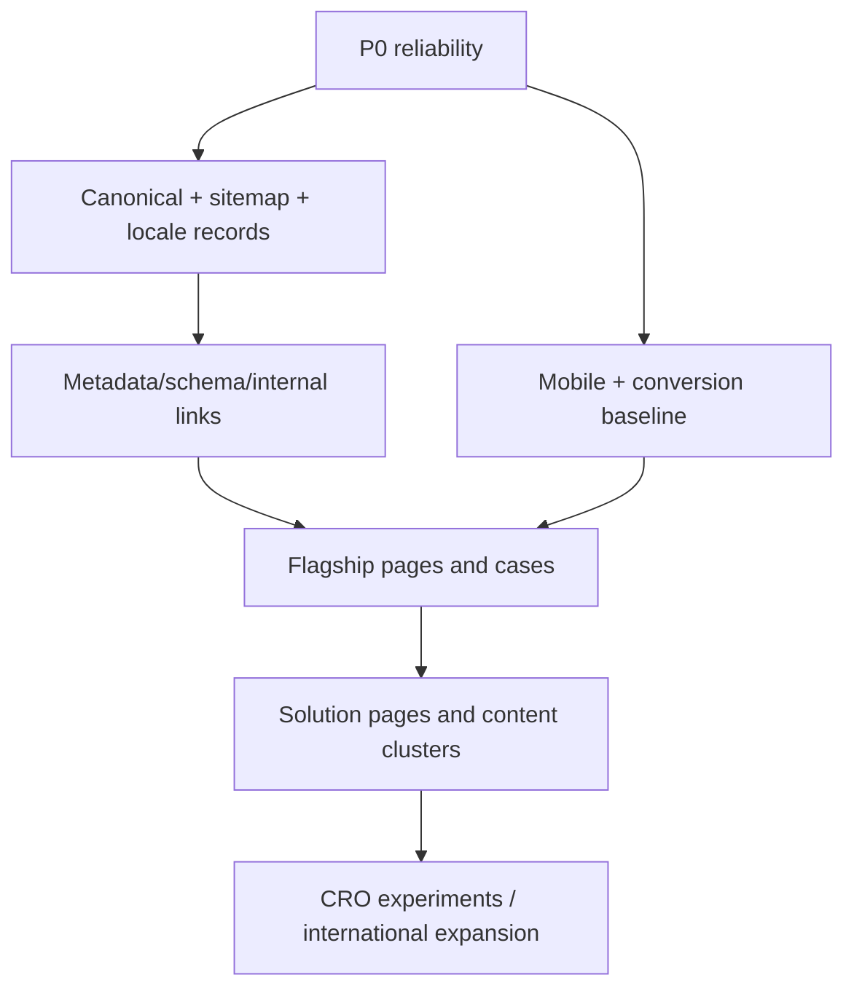

# Prioritized implementation backlog

Impact: H/M/L. Effort: XS (<0.5d), S (0.5–1d), M (2–4d), L (1–2w), XL (>2w). Owners are accountable leads; work may span disciplines.

## P0 — critical

| ID | Recommendation | Business | SEO | UX | Effort | Owner | Acceptance criteria |
|---|---|---:|---:|---:|---:|---|---|
| P0-01 | Fix DB/session pooling and dynamic-render capacity | H | H | H | M | Backend/DevOps | 0 non-2xx in agreed load test; no `EMAXCONNSESSION`; alerts configured. |
| P0-02 | Make builds fail on content query/prerender errors | H | H | M | S | DevOps/frontend | DB errors produce nonzero CI; no empty 200 pages can deploy. |
| P0-03 | Remove `/null`, broken English sector links and test content | H | H | H | S | Frontend/CMS | No null slug can publish; internal crawl has no broken public link; test page 404/410. |
| P0-04 | Unify final host across env, canonical, sitemap, hreflang, schema and OG | H | H | L | S | Frontend/SEO | Every declared URL is final `www` 200; one-hop HTTP/non-www redirects. |
| P0-05 | Add production route/status smoke tests | H | H | M | M | QA/engineering | Home/hubs/top details/contact/sitemap tested by locale every deploy. |

## P1 — high

| ID | Recommendation | Business | SEO | UX | Effort | Owner | Acceptance criteria |
|---|---|---:|---:|---:|---:|---|---|
| P1-01 | Rebuild sitemap from validated published locale records | H | H | L | M | Frontend/SEO | All/only canonical 200 indexable URLs; real lastmod; no noindex/test/null. |
| P1-02 | Enforce native-English publication gate; remove TR fallback on EN 200s | H | H | H | L | CMS/content/engineering | Every EN indexed page has native title, description, H1/body, alt and reciprocal alternate. |
| P1-03 | Fix metadata failure mode and missing/duplicate project metadata | H | H | M | M | Frontend/content | DB failure never emits empty metadata with 200; top pages pass metadata QA. |
| P1-04 | Remove unsupported rating/global SoftwareApplication schema; fix logo/OG assets | M | H | L | S | SEO/frontend | Valid page-accurate graph; no 404 schema/social assets; claims visible/evidenced. |
| P1-05 | Fix mobile overflow at 320/375/390/430/768 | H | M | H | M | Frontend/design | No clipped text/controls or horizontal scroll at test sizes and 200% zoom. |
| P1-06 | Replace two floating CTAs with one coordinated mobile action model | H | L | H | S | CRO/design/frontend | No content obstruction; one primary CTA; WhatsApp remains discoverable. |
| P1-07 | Put real activation/showreel and verified brand proof in first two homepage screens | H | M | H | L | Creative/content/frontend | What/who/why/proof understood in user test; optimized media within performance budget. |
| P1-08 | Rewrite homepage category/value proposition and CTA | H | H | H | M | Strategy/content | Category, buyer, end-to-end difference and outcome explicit; native TR/EN. |
| P1-09 | Rebuild top five case studies with reusable evidence structure | H | M | H | L | Content/account/creative | Each has challenge, idea, journey, tech/production, approved facts, media, CTA. |
| P1-10 | Rebuild AI Activation and AI Photo flagship pages | H | H | H | L | SEO/content/design | Unique native pages with proof, operating facts, case, FAQ and brief. |
| P1-11 | Consolidate service taxonomy to five capability groups | H | H | H | L | Strategy/SEO/content | Buyer-readable nav; weak pages consolidated/noindexed with redirects. |
| P1-12 | Build one event-brief conversion flow with source/service context | H | L | H | M | CRO/frontend/sales | Prefilled context, useful scoping fields, privacy notice and conversion events. |
| P1-13 | Repair internal graph and orphan hubs | M | H | M | M | SEO/content | Every indexable page has contextual in/out links; hubs link all supported children. |
| P1-14 | Consolidate GTM/gtag/Ads and define analytics event taxonomy | H | M | M | M | Analytics/frontend | One tag path, no duplicate pageviews/conversions; documented events and consent. |
| P1-15 | Publish English privacy/terms and event-data/AI processing summary | H | M | H | L | Legal/content | Legal-approved native pages; EN footer remains in EN; retention/process clear. |
| P1-16 | Validate/remove unsupported commercial claims | H | M | M | M | Operations/legal/content | 1K+/100+/30 days/99%/ratings each has evidence/scope or is removed. |

## P2 — medium

| ID | Recommendation | Business | SEO | UX | Effort | Owner | Acceptance criteria |
|---|---|---:|---:|---:|---:|---|---|
| P2-01 | Reduce fonts to display/text/optional mono | M | L | M | M | Design/frontend | Font requests/bytes materially lower; no visual regression. |
| P2-02 | Standardize Cloudinary image component, sizes and media budgets | M | M | M | M | Frontend/creative | Lighthouse image waste reduced; correct dimensions/alt/posters. |
| P2-03 | Make AI chat/gallery/quote UI lazy and accessible | M | L | M | M | Frontend | Not in critical JS; keyboard/dialog/live-region QA passes. |
| P2-04 | Add reduced-motion, focus, skip link and footer contrast fixes | M | L | H | M | Frontend/design | WCAG 2.2 AA manual checks; Lighthouse contrast passes. |
| P2-05 | Add typed locale-aware metadata/route factory | M | H | M | L | Frontend | One source for paths, canonicals, hreflang, OG and schema; tests cover parity. |
| P2-06 | Validate gallery/FAQ/spec JSON in CMS; migrate to typed JSON | M | M | H | L | Backend/CMS | Malformed data cannot publish or crash render. |
| P2-07 | Replace blanket homepage redirects with relevant 301/404/410 | M | M | M | M | SEO/frontend | Redirect map tested; no unrelated deleted URL maps to `/`. |
| P2-08 | Resolve software-sector strategy and duplicate English hubs | M | H | M | M | Leadership/SEO | Separate proven business line or consolidate/noindex; no duplicate intent/title. |
| P2-09 | Add About team/process/production/reliability content | H | M | H | L | Leadership/content/creative | Team/process/market model and real operational imagery live in TR/EN. |
| P2-10 | Publish four proof-led solution pages | H | H | H | XL | Content/SEO/design | Trade show, launch, retail, corporate pages each link cases and capabilities. |
| P2-11 | Create project-specific OG templates and share-preview QA | M | M | M | M | Design/frontend | Top 20 previews pass LinkedIn/WhatsApp checks. |
| P2-12 | Add CSP and consent-aware third-party loading | H | L | M | L | Security/legal/frontend | Tested CSP; nonessential marketing/maps load per consent policy. |
| P2-13 | Establish lint/type baseline and remove ignore-build-errors | M | L | M | L | Engineering | Public app type/lint clean; CI blocks regressions; handoff artifacts excluded. |
| P2-14 | Add GSC/organic lead dashboard by locale and landing page | H | H | L | M | Analytics/SEO | Query/page/index/conversion reporting available; no invented volume. |

## P3 — nice to have / experimentation

| ID | Recommendation | Business | SEO | UX | Effort | Owner | Acceptance criteria |
|---|---|---:|---:|---:|---:|---|---|
| P3-01 | Service demo/output sampler for approved AI styles | M | M | H | L | Product/creative | Brand-safe, moderated, privacy-cleared demo with lead path. |
| P3-02 | Project-specific art direction within shared case system | M | L | H | L | Creative/design | Flagship cases feel distinct while accessibility/performance remain stable. |
| P3-03 | Test outcome-led hero/CTA after baseline fixes | M | L | M | M | CRO | Predefined hypothesis, qualified-brief metric and guardrails. |
| P3-04 | Add press/awards/certification modules only when verified | M | M | M | S | PR/content | Each item links to authoritative evidence. |
| P3-05 | Create reusable post-event case intake workflow in CMS | H | M | M | L | Ops/CMS | Project close cannot complete without evidence/media/rights fields. |

## Dependencies

Do not begin broad content production or paid international acquisition before P0 reliability, canonical/sitemap correctness and native-English gating are complete.
